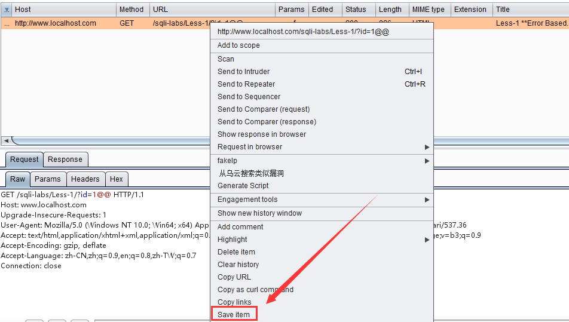
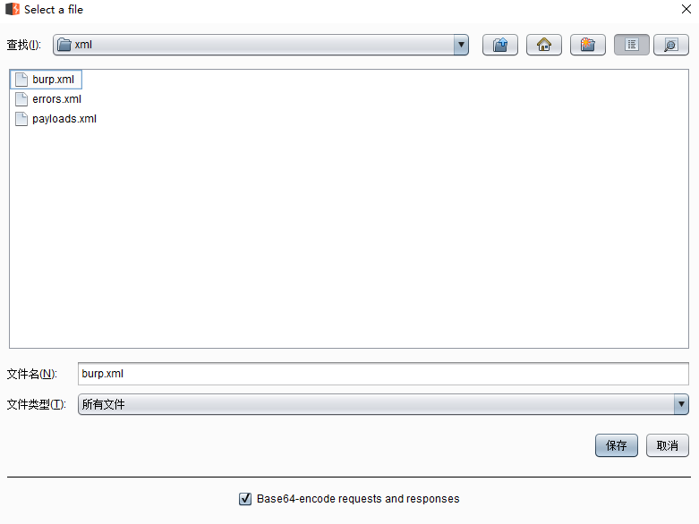
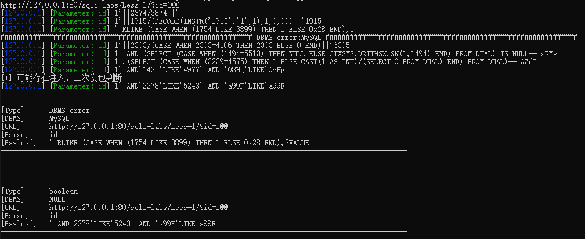

# PassiveSqlCheck
被动式注入扫描器，借鉴了lufei大佬的 SqlChecker ： [https://github.com/lufeirider/SqlChecker](https://github.com/lufeirider/SqlChecker)

# 更新
- `2020-07-14` ：支持普通json、xml、文件mutipart格式的数据包
- `2020-07-15` ：更新检测https的一点逻辑，还不完善，支持伪静态数据包（需自主标记注入点）
- `2020-07-16` ：修复检测https的一点逻辑，可能还不完善
- `2020-07-23` ：修复两处漏报问题：1. 有的数据包解码后响应包与原始数据包不一致，所以在解析数据包时取消了解码操作；2. 添加了当真假数据包的ratio都小于给定的值的时候的检测逻辑
- `2020-07-24` ：修复一处由于编码问题引起的bug，该bug导致`keywordreplace`函数失效，同时增加该函数判断逻辑，匹配更多情况
- `2020-08-17` ：修改copy为deepcopy，该处错误曾导致payload失效

# 环境
python2

缺什么装什么吧

# 使用
1. 选择 BurpSuite 中 Proxy模块 中的 `HTTP history` ,将所需检测的数据包保存在burp.xml中：

2. 配置程序

    func/setting.py:
- `GARBAGE_PARAM` 存放不想检测的参数

  func/SqlChecker.py:
- 如需微信告警需添加 `SERVER_JIANG_API`

2. 命令行执行 `python passiveSqlCheck.py` 

# 程序逻辑
检测bool和time注入，可批量检测，如果存在注入，则停止检测当前数据包其他参数，继续检测下一个数据包；结果会在命令行输出，并按host保存在result文件夹中并微信告警

- 检测bool注入，逻辑借鉴sqlmap
- 检测time注入，但只是凭超时判断是否存在time注入，可能存在误报
- 检测数据包报错信息，可在xml/errors.xml中添加
- payload可在xml/payloads.xml中添加，需按照一定格式添加

# 碎碎念
菜鸟一枚，不会python，不会注入，程序bug一堆

我：lufei大佬牛逼
